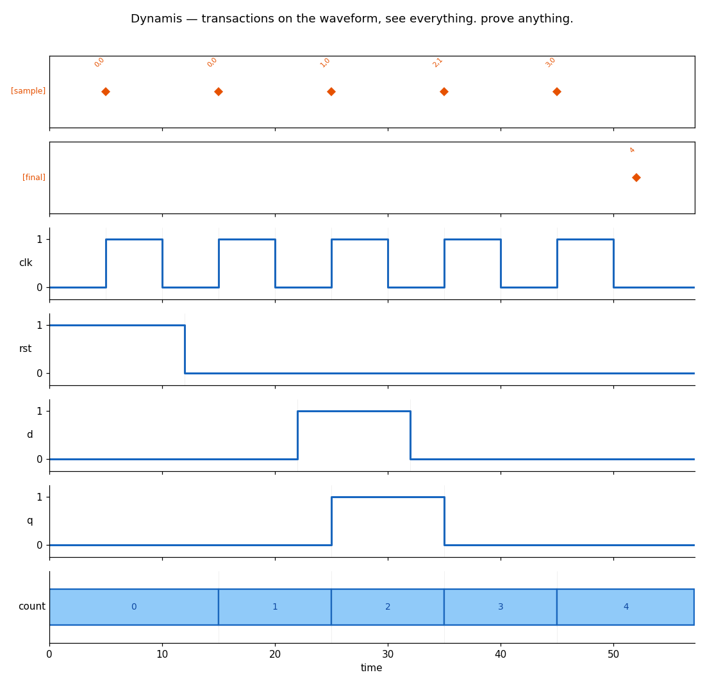

# Dynamis

[](LICENSE)
[](../../actions)



**See everything. Prove anything.**

Dynamis (Greek δύναμις — power, potential) is a simulator-agnostic
verification intelligence platform for SystemVerilog/UVM. It does not
try to out-run VCS; it makes every simulator's output — Verilator,
VCS, Xcelium — fully transparent at the transaction level.

We know exactly what a transaction is, **because we implemented the
event scheduler underneath it.**

## What's here

| directory | what | status |
|---|---|---|
| [`core/`](core/) | **Dynamis Core** — a from-scratch SystemVerilog simulator (~1700 lines): full front-end (lex/parse/elaborate/generate/classes), 4-state event engine, process-level JIT (1.85x). Cross-validated line-for-line against Verilator 5.052. | research core, Apache-2.0 |
| [`tx/`](tx/) | **Dynamis TX** — simulator-agnostic transaction recorder (DPI-C) + interactive HTML viewer (`txview`) + regression diff CI gate (`txdiff`). Runs on Verilator, VCS, Xcelium unchanged. | the product |

## Why

Every major simulator locks its debug data to its own waveform format.
Dynamis breaks that lock with the DPI-C standard: one recording layer,
every simulator, one portable transaction database.

- Record: `tx_record("write", $time, "addr=3,data=7");` — or one
  `record()` call from any class extending `tx_recorder`.
- View: `txview.py run.jsonl --vcd run.vcd` → single interactive HTML.
- Gate: `txdiff.py golden.jsonl run.jsonl` → exit 1 on any semantic
  difference (robust to timing jitter, precise on field mismatches).

## Quick start

```bash
# record from a real simulation (Verilator shown; identical on VCS/Xcelium)
cd tx/examples
verilator --binary --timing -Wno-fatal -I../src ../src/txdpi.cpp \
          tx_demo_tb.sv -o Vdemo && ./obj_dir/Vdemo        # -> tx.jsonl

# visualize + diff
python3 ../tools/txview.py tx.jsonl -o txview.html
python3 ../tools/txdiff.py ../tests/golden/tx.jsonl tx.jsonl
```

See [`tx/ci/run_regression.sh`](tx/ci/run_regression.sh) for the
CI gate used in `.github/workflows/regression.yml`.

## The engine story

`core/` exists because the best way to build a debugger is to have
built the machine being debugged. It implements, in readable Python:

- event scheduling with IEEE 1800 regions (active/NBA, delta cycles)
- 4-state logic (0/1/X/Z) with X propagation, inertial/transport delay
- elaboration: modules, parameters, generate-for unrolling, hierarchical
  references (`g[0].u.count`), classes with `new()`
- a process-level JIT that compiles SV processes to Python bytecode
  (the VCS compiled-code technique, validated by dual-path execution)

If you want to understand how VCS/Xcelium/Verilator work inside,
`core/` is a guided tour in ~1700 lines.

## License

Apache-2.0. See [LICENSE](LICENSE).
